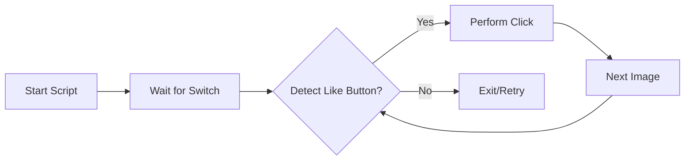

# 👍 Facebook Auto-Liker
**Simple, Hacky, and Efficient Bot for Social Automation**

[](https://github.com/google/gemini-cli)
[](https://www.python.org/)
[](https://pyautogui.readthedocs.io/)
[](https://opensource.org/licenses/MIT)

**Facebook Auto-Liker** is a lightweight Python script that uses computer vision and keyboard/mouse automation via `PyAutoGUI` to automatically like images on Facebook. It's a "set and forget" tool for social interaction.

`✅ Social Automation | ✅ Computer Vision | ✅ MIT Licensed | ✅ 45+ Stars Utility`

## 🎬 Showcase Gallery
| 🖼️ Pattern Matching | 📟 Automation Logic |
| :---: | :---: |
|  |  |

## 🏗 Architecture
The bot operates using a simple linear execution loop powered by Pixel Matching and GUI automation.



### Core Components
- **Automation Logic (`autoLikeFB.py`)**: The main driver script that handles timing, coordinate calculation, and loop control.
- **Pattern Matching (`likeButtonOnFB.PNG`)**: The reference image used by PyAutoGUI to locate the target element on the screen.
- **Environment Logic**: Uses `time.sleep()` for surgical pacing between interactions to avoid detection.

## 🚀 Getting Started

1. **Install Dependencies**:
   ```bash
   pip install pyautogui
   ```

2. **Configuration**:
   Ensure you have a screenshot of the Facebook Like button named `likeButtonOnFB.PNG` in the project root (tailored to your monitor resolution).

3. **Execution**:
   Run the script and immediately switch to your Facebook tab (Alt+Tab).

## 📜 License
This project is licensed under the **MIT License** - see the [LICENSE](LICENSE) file for details.

---
*Built with ❤️ for Social Automation.*
