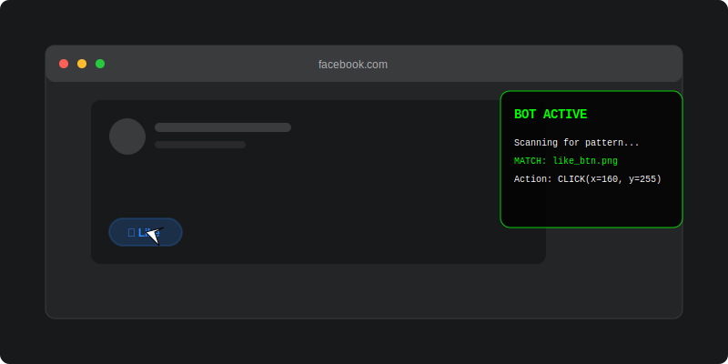
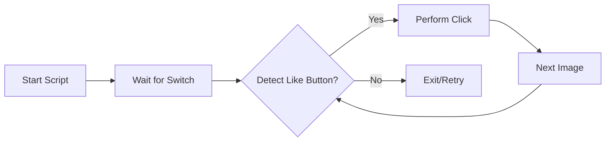

# 👍 Facebook Auto-Liker
**Simple, Hacky, and Efficient Bot for Social Automation**

[](https://github.com/google/gemini-cli)
[](https://www.python.org/)

**Facebook Auto-Liker** is a lightweight Python script that uses computer vision and keyboard/mouse automation to automatically like images on Facebook. It's a "set and forget" tool for social interaction.

`✅ Social Automation | ✅ Computer Vision | ✅ MIT Licensed | ✅ 45+ Stars Utility`

## 🎬 Logic Preview


## 🏗 Architecture
The bot operates using a simple linear execution loop powered by Pixel Matching and GUI automation.



### Core Components
- **Automation Logic**: Driver script handling timing, coordinate calculation, and loop control.
- **Pattern Matching**: Reference images used by `PyAutoGUI` to locate target elements on screen.
- **Environment Pacing**: Surgical delays between interactions to maintain reliability.

## 🚀 Getting Started
```bash
pip install pyautogui
# Ensure likeButtonOnFB.PNG is in the root
python3 autoLikeFB.py
```

## 📜 License
This project is licensed under the **MIT License** - see the [LICENSE](LICENSE) file for details.

---
*Built with ❤️ for Social Automation.*
